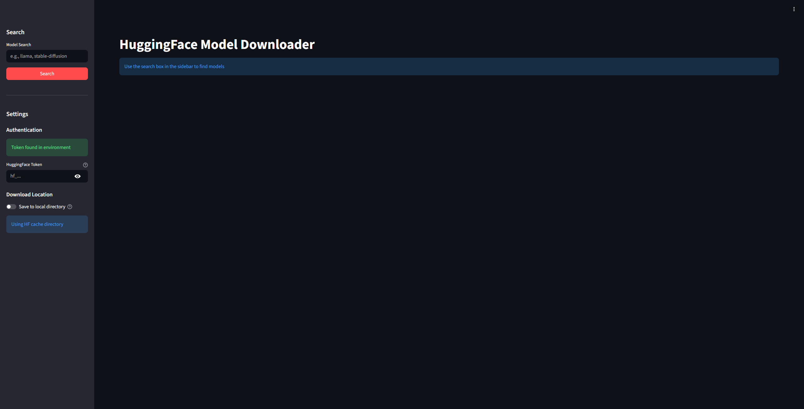
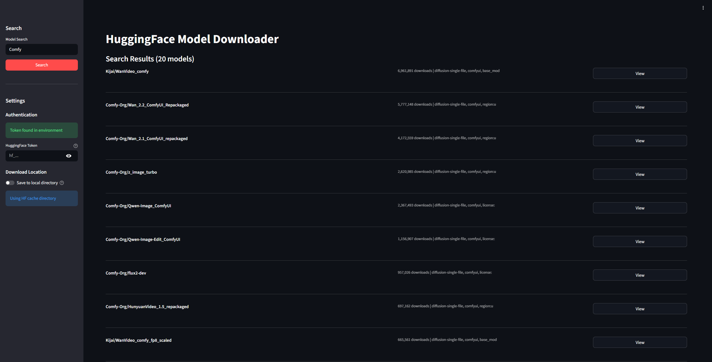
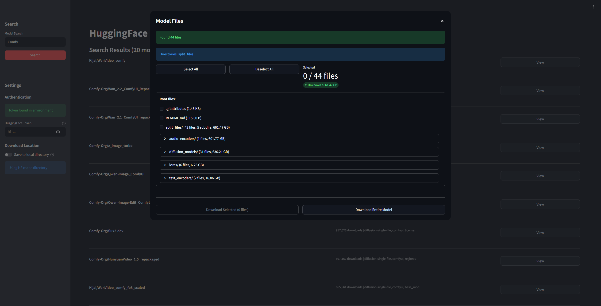

# HF Downloader

A Streamlit application for downloading models from HuggingFace.

## Screenshots

### Main Page


The main interface where you can enter a HuggingFace model repository name to search and download.

Turn on toggle button to download model where to the directory where user set the path in .env file.

If toggle is off, selected model will be downloaded to basic `HF_CACHE` directory.

### Search Result


The list of search result will be shown at the main page.

User can click View button to see detailed information.

### Detail View


Detailed view about repository information.

User can download whole or selected items.

Provides progress bar,

## Requirements

- Python 3.11+
- HuggingFace account and API token(optional)

## Setup

1. Clone the repository

2. Create a `.env` file based on `.env.example`:
   ```bash
   cp .env.example .env
   ```

3. Add your HuggingFace token to `.env`:
   ```
   HF_TOKEN=your_token_here
   ```

## Run Locally

```bash
pip install -r requirements.txt
streamlit run app.py
```

## Run with Docker

Build the image:
```bash
docker build -t hf-downloader .
```

Run the container:
```bash
docker run --env-file .env -p 8501:8501 hf-downloader
```

Access the app at http://localhost:8501
